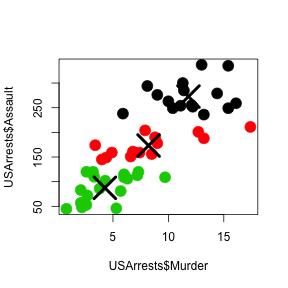
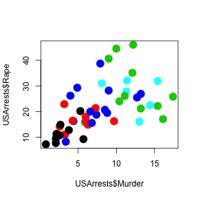

## Why Clustering
First of all, clustering allows you to group data in an unsupervised learning method. That means that no labels are provided to classificate the data and classifications are built given the pattern observed in data. 
Clustering can be useful for retrieving similar observations given that we already known one observation. 
In the database that we use for this analysis, USAarrest, if we cluster that states with similar arrest pattern, and given a sucefull public policy to reduce criminilaty in an given state, we could know in advance what other states this specific policy could be worth/usefull too.

---
## Clustering and profile.
We are going to investigate the profile of arrests in the USA with state level data. We are considering variables like percent of people arrested by Rape, Muder, Assault and controlling for number of people living in urban area.  

```r
library(ggplot2)
data("USArrests")
head(USArrests,5)
```

```
##            Murder Assault UrbanPop Rape
## Alabama      13.2     236       58 21.2
## Alaska       10.0     263       48 44.5
## Arizona       8.1     294       80 31.0
## Arkansas      8.8     190       50 19.5
## California    9.0     276       91 40.6
```

---
## How does the app help you understand how clustering works.
The apps gives an exemple of how we can cluster states in USA, given the pattern of arrests type. In an exemple below we cluster using, murder, assault, Urban Population an Rape arrests.  

We can see that we could form 3 groups states given the pattern of Murder and Assalt. Low, Medium and High, since both variables are correlated. 

---
## How does the app help you explain the Arrest profile of Cities.

Since we can choose the number of clusters and the variables that can be considered
for the visualization, we can check how cities can be better grouped. And given that, we could differentiate security public policies for cities according to the pattern of criminality. 



---


